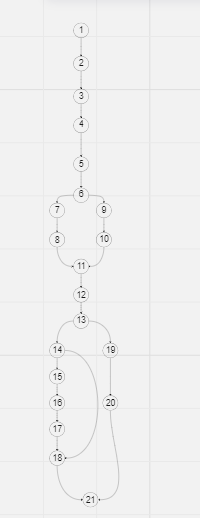

# Analise Fluxo de Grafo

    import java.sql.Connection;
    import java.sql.DriverManager;
    import java.sql.ResultSet;
    import java.sql.Statement;

        public class User {
        4 - public Connection conectarDB(){
        5 - Connection conn = null;
        6 - try{
        7 - Class.forName("com.mysql.Driver.Manager").newInstance();
        7 - tring url = "jdbc:mysql://127.0.0.1/test?user=lopes&password=123";
        7 - conn = DriverManager.getConnection(url);
        }8 
    
            9 - catch (Exception e){} 10
            11 - return conn;
        }

        
        1 - public String nome = "";
        1 - public boolean result = false;
        

        
       2 -  public boolean VerificarUsuario(String login, String senha){
            3 - String sql = "";
            3 - Connection conn = conectarDB();
    
           12 - sql += "select nome from usuarios ";
           12 - sql += "where login = " + "'" + login + "'";
           12 - sql += " and senha = " + "'" + senha + "';";
            13- try{
                14 - Statement st = conn.createStatement();
                14 - ResultSet rs = st.executeQuery(sql);
                15 - if(rs.next()){
                    16 - result  = true;
                    16 - nome = rs.getString("nome");
                }17
    
            } 18
            19 - catch (Exception e){
    
            }20 
            21 - return  result;
        }
    
    }     
## O fluxo

    Este bloco de código tem o objetivo de validar 
    se um usuario existe no banco de dados, se sim retornar o seu nome
    ele passa pela criação da conexão, em seguida retona se a conexão foi feita com sucesso
    em seguida se a conexão for estabelecida ele verifica a existencia do usuario   
    e retorna o nome.

 

## O Grafo de Fluxo

 Temos o fluxo do código em forma de grafo a seguir

## Complexidade Ciclomática 

 
    A complexidade ciclomática é calculda com base 
    na quantidade de arestas e nós, com a seguinte expressão
    aresta - nó + 2 = x.

    Com base nela, temos uma noção de quantos caminhos um grafo
    pode seguir.

    Contando com esse grafo de 23 arestas e 21 nós
    temos o seguinte resultado:

    23 - 21 + 2 = 4.

    Ou seja para esse grafo temos 4 caminhos possiveis. 

## Caminhos

    Com base na complexidade sabemos que o grafo nos 
    apresenta 4 caminhos indenpendentes que são eles:

    Caminho 1:

    1-2-3-4-5-6-9-10-11-12-13-20-21.

    Este caminho se baseia caso uma exception ocorra na conexão.

    Caminho 2:

    1-2-3-4-5-6-7-8-11-12-13-14-18-21.

    Este caminho se baseia caso a busca do usuario não retorne
    nada, ou seja, usuario não encontrado.

    Caminho 3:

    Este caminho se baseia caso o usuario seja encontrado.

    1-2-3-4-5-6-7-8-11-12-13-14-15-16-17-18-21.

    Caminho 4:

    1-2-3-4-5-6-7-8-11-12-13-18-20-21.

    Este caminho se baseia numa exception que possa ocorrer 
    que possa ocorrer durante a busca do usuario no banco.

